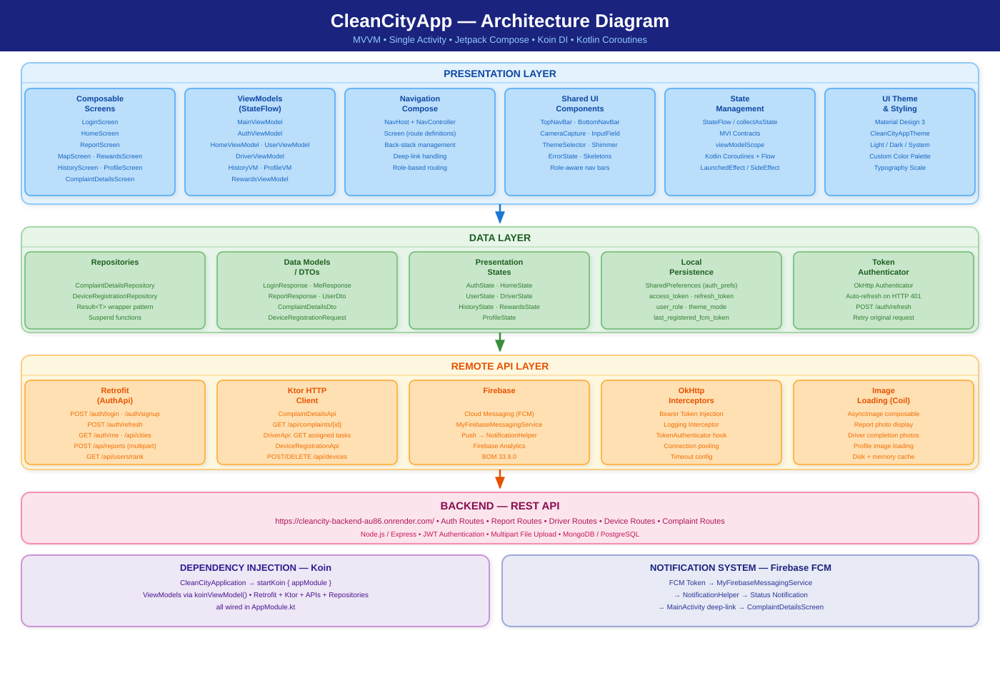
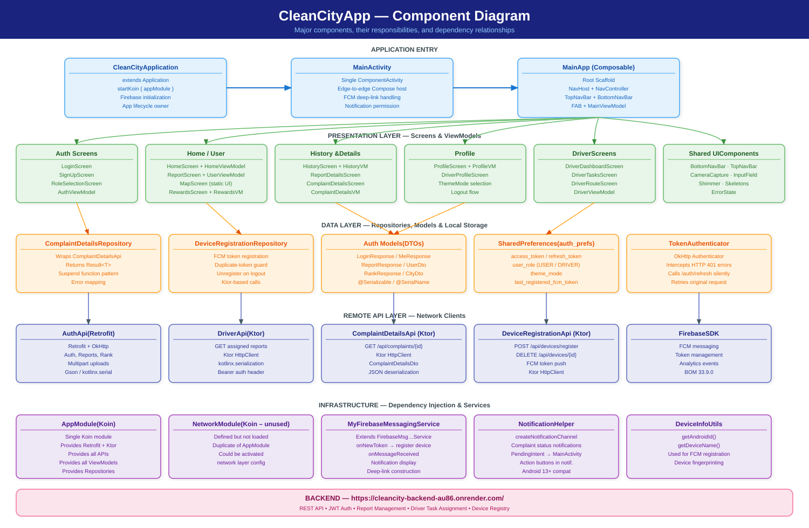
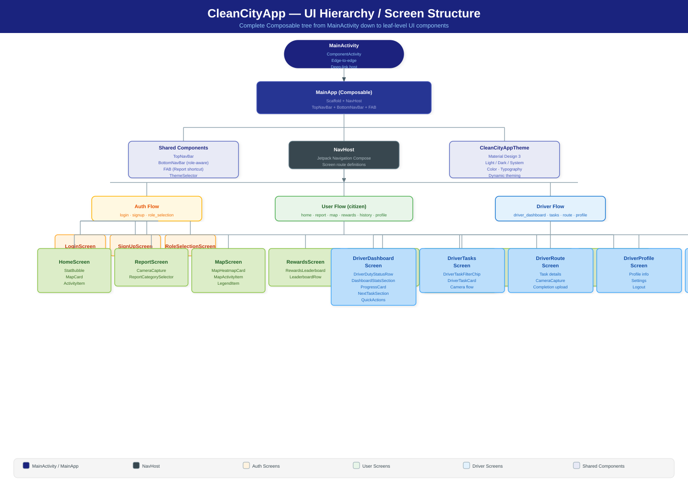
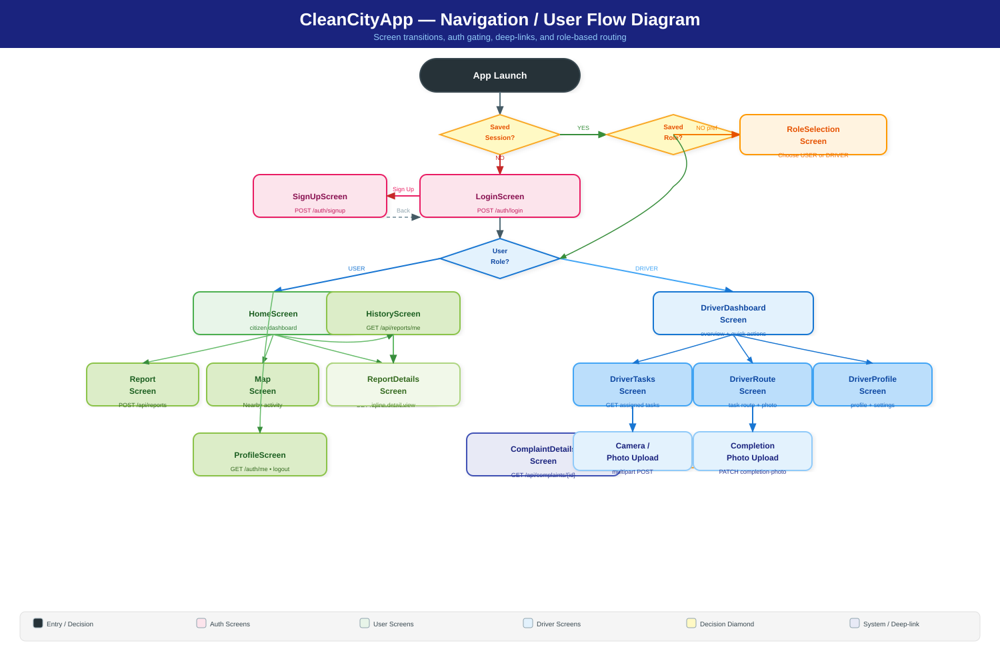
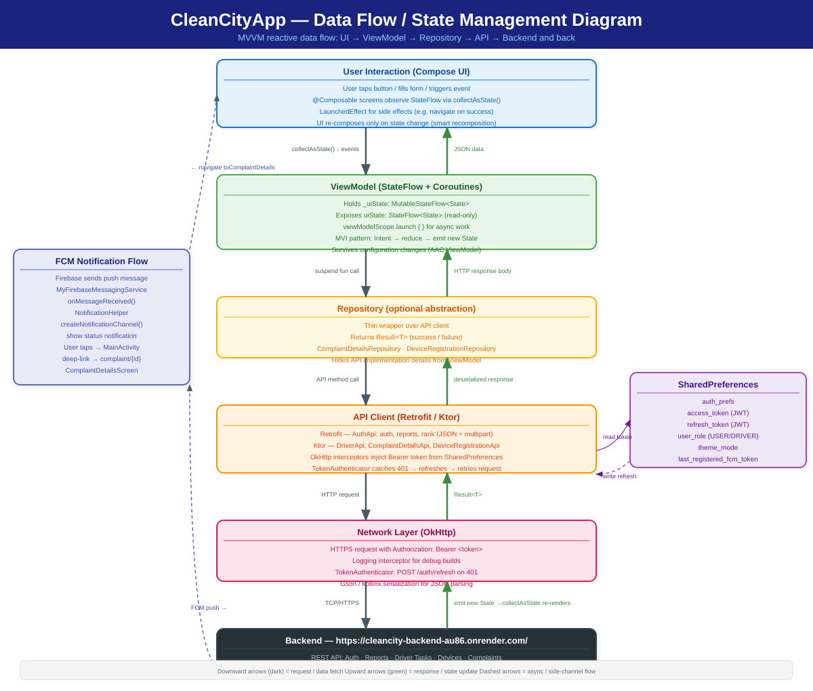

# CleanCityApp — Architecture Diagrams

Five architecture diagrams for the **CleanCityApp** Android project.
All diagrams are rendered as SVG (GitHub renders them natively).

---

## 1. Architecture Diagram

Overview of the MVVM layered architecture — Presentation → Data → Remote API → Backend.

---

## 2. Component Diagram

All major components (Application, Activities, ViewModels, Repositories, API clients,
DI modules, Services) and their dependency relationships.

---

## 3. UI Hierarchy / Screen Structure

Full Composable tree from `MainActivity` down to every leaf-level UI component,
split into Auth, User (citizen), and Driver branches.

---

## 4. Navigation / User Flow

Screen-to-screen transitions, role-based routing (USER vs DRIVER),
auth gating, FCM deep-links, and bottom-nav flows.

---

## 5. Data Flow / State Management

End-to-end reactive data flow:
UI events → ViewModel (StateFlow) → Repository → API Client → Network → Backend,
plus return path (response → state update → recomposition) and FCM side-channel.

---

## Tech Stack Summary

| Category | Technology |
|----------|-----------|
| Language | Kotlin |
| UI | Jetpack Compose + Material 3 |
| Architecture | MVVM (partial MVI for some screens) |
| Navigation | Jetpack Navigation Compose |
| DI | Koin (`appModule`) |
| HTTP (primary) | Retrofit + OkHttp |
| HTTP (secondary) | Ktor HttpClient |
| Push Notifications | Firebase Cloud Messaging (FCM) |
| Analytics | Firebase Analytics |
| Image Loading | Coil (AsyncImage) |
| Persistence | SharedPreferences (`auth_prefs`) |
| State | Kotlin StateFlow + Coroutines |
| Backend | Node.js REST API (Render.com) |
